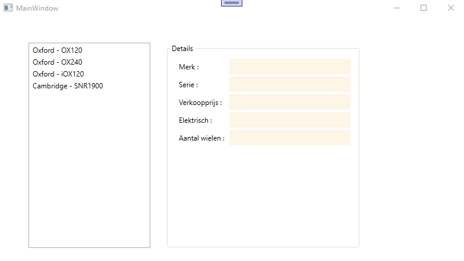

# Oefening Hoofdstuk 1  
  
Open de solution.  
Je krijgt een window te zien waar alle controls en event-handlers reeds op gemaakt zijn .    
  
## Deel 1  

Maak een klasse aan met de naam Fiets.  
Je mag deze klasse (eenmalig) aanmaken binnen je WPF project.  

Een fiets heeft 5 eigenschappen :   
  * Merk : tekst  
  * Serie : tekst  
  * Verkoopprijs : de prijs (decimalen voorzien) waaraan deze fiets zal verkocht worden  
  * IsElektrisch : waar of niet waar  
  * AantalWielen : een geheel getal groter dan 0  

De klasse heeft 2 constructors : 
  * Een lege argumentloze constructor  
  * Een constructor die evenveel argumenten ontvangt als er eigenschappen zijn en deze argumenten vervolgens ook toekent aan de eigenschappen.  
  
De klasse overschrijft tenslotte ook de ToString() methode.  Wat er precies moet afgebeeld worden in de plaats zie je in de demo onderaan.  

## Deel 2  

Bestudeer aandachtig de controls in je WPF venster.  

Tijdens het opstarten voeg je een aantal dummy fietsen toe aan de listbox (gebruik uiteraard instanties van je klasse hiervoor).  
Wanneer in de listbox een fiets wordt geselecteerd dan dienen alle eigenschappen van die fiets in de corresponderende controls te verschijnen.  
  

  

